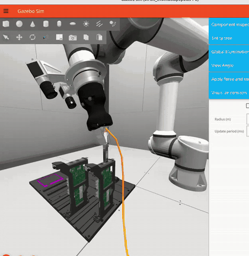
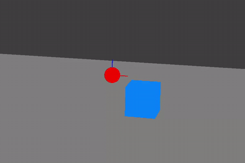

# HIL-SERL for ROS2

[](https://opensource.org/licenses/Apache-2.0)
[](https://hil-serl.github.io/)
[](https://github.com/b-robotized-forks/hil-serl/actions/workflows/unit-tests.yml)

This is a fork of [rail-berkeley/hil-serl](https://github.com/rail-berkeley/hil-serl), a framework
for training precise robotic manipulation policies with human-in-the-loop reinforcement learning
([paper](https://arxiv.org/abs/2410.21845), [project page](https://hil-serl.github.io/)).

The fork adds ROS2 support and a robot-agnostic architecture that also works in simulation.
The core algorithm (`serl_launcher`) is kept almost unchanged.
The ROS1/Franka-specific `serl_robot_infra` stack and the Franka example tasks were removed.
They remain available in the [original repository](https://github.com/rail-berkeley/hil-serl).

## What this fork adds

- A robot-agnostic framework layer (`serl_framework`): ROS-free `RobotAdapter` and `TeleopAdapter`
  interfaces plus a generic `RobotEnv`. The RL code never talks to a specific robot or middleware.
- A ROS2 implementation of that interface (`serl_ros2`, `serl_msgs`). Supporting a new robot means
  publishing a handful of topics and providing a few services.
- A simulation-first workflow: a small [ursina](https://www.ursinaengine.org/) based simulator runs
  the full pipeline (teleop, data collection, classifier, training) without any hardware.
- Improved training scripts (moved from `examples/` into `serl_framework.train`): resumable
  training, CSV metrics logging, actor-side checkpoints, and more.
- Improved data collection: incremental demo saving with resume, config snapshots next to
  recordings, better success/failure labeling, and a live classifier probability monitor.
- A teleop stack for SpaceMouse, keyboard, and gamepad, including a pose-to-Joy bridge and a
  teleop mux (see [serl_ros2/README.md](serl_ros2/README.md)).
- Python 3.12 support and a unit test suite.

This code was used in the [AI for Industry Challenge](https://www.intrinsic.ai/events/ai-for-industry-challenge) (team b-robotized),
where policies performed cable insertion tasks.



[Higher-resolution screencast in [docs/media/aic_insertion.mp4](docs/media/aic_insertion.mp4)]

> [!NOTE]
> This fork does **not** include the full running competition example, only the HIL-SERL base it
> was built on. In terms of this repository, the competition setup is basically an `experiment`
> (like the ones in `examples/experiments/`), but it also depended on the challenge framework as a
> whole (the `aic` toolkit packages and its pixi environment) and was developed separately.
> It still needs some grooming before it can be published, and it would have to be published as a
> fork of the `aic` repository itself rather than as part of this one.

## Prerequisites

Software:

- Linux (tested on Ubuntu 24.04).
- ROS 2, tested with **Jazzy** and **Kilted**. Only `serl_ros2` and `serl_msgs` touch ROS, the
  rest of the stack is ROS-free.
- Python 3.12 (3.10 is also covered by CI) with **JAX 0.4.36** (see the note below).

Hardware:

- **Learner**: an NVIDIA GPU with CUDA 12 support. A single mid-range GPU is sufficient, we
  trained on one NVIDIA L4 (in a cloud instance). The learner can also run on a separate machine,
  see [running the learner remotely](docs/robot_walkthrough.md#running-the-learner-remotely).
- **Actor**: no GPU needed, policy inference runs fine on CPU. On Intel hybrid CPUs see the
  [performance notes](docs/robot_walkthrough.md#ros2-timer-jitter-on-intel-hybrid-cpus).
- **Teleop device** for demonstrations and interventions: a SpaceMouse is strongly recommended,
  keyboard and gamepad are also supported.
- **Robot**: any robot with a ROS 2 driver that can track Cartesian TCP pose targets (e.g. an
  impedance or admittance controller), plus one or more cameras. See
  [docs/robot_integration.md](docs/robot_integration.md). For the simulated demo, no hardware is
  required at all.

## Installation

See [INSTALL.md](INSTALL.md) for the full setup (Python environment, JAX, core packages,
smoke tests, ROS2 workspace).

> [!IMPORTANT]
> This fork requires **JAX 0.4.36**. The upstream 0.4.35 breaks on Python 3.12 / Ubuntu 24.04,
> and newer JAX versions do not work yet (tried with 0.9, upgrading requires code changes in serl_launcher).

## Quickstart: simulated cube demo (no hardware)

This is not a robot example. It is a smoke test for the whole framework: a red ball stands in for
the robot TCP and is trained to move to the blue cube in a deliberately minimal
[ursina](https://www.ursinaengine.org/) simulator. Everything is real except the robot: the ROS2
adapter, teleop, data collection, the reward classifier, and the RLPD actor/learner loop all run
exactly as they would on hardware.



The tutorial in [examples/experiments/cube_demo_ros2/README.md](examples/experiments/cube_demo_ros2/README.md)
walks through the full pipeline on this example: start the sim, teleoperate,
optionally train a reward classifier, record demonstrations, and run actor/learner training.
The short version:

```bash
# Terminal 1: the simulated "robot"
python serl_ros2/serl_ros2_sim/ursina_sim.py --rate 50 --cameras front,wrist \
    --image-width 128 --image-height 128 --publish-images

# Terminal 2: record demos (teleop via SpaceMouse, keyboard, or gamepad)
PYTHONPATH=examples python -m serl_framework.train.record_demos --exp_name cube_demo_ros2 --successes_needed 10

# Terminals 3 + 4: learner and actor
cd examples/experiments/cube_demo_ros2
bash run_learner.sh ../../../demo_data/<your_demo>.pkl
bash run_actor.sh --ip localhost
```

The training scripts find experiment configs through a mapping module (`--config_mapping`,
default `experiments.mappings`). For the bundled examples this module lives in `examples/`,
which is why the commands above set `PYTHONPATH=examples`. For your own experiments, point
`--config_mapping` at your own package instead.

## Architecture

The fork removes the original HTTP/Flask robot bridge and keeps the robot-agnostic core
(`serl_launcher`). The Gymnasium env (`RobotEnv`) talks to a **RobotAdapter**, a plain Python
interface that does not know about any middleware. The ROS2 implementation of that adapter
(`serl_ros2`) is the only component that talks ROS2:

```
┌─────────────────────────────────────────────────────────────┐
│                              HIL-SERL                       │
│  ┌──────────────┐                       ┌──────────────┐    │
│  │ACTOR PROCESS │ ── env.step/reset ───►│  RobotEnv    │    │
│  │  (Robot PC)  │                       │  (gym)       │    │
│  └──────┬───────┘                       └──────┬───────┘    │
│         │ AgentLace (ZMQ)                      │            │
│         │ transitions / weight updates         │            │
│  ┌──────┴───────┐                              │            │
│  │  LEARNER     │                              │            │
│  │  (GPU PC)    │                              │            │
│  └──────────────┘                              │            │
└────────────────────────────────────────────────┼────────────┘
                                             in-process API
                                                 │
┌────────────────────┐   ROS2 topics   ┌─────────┴───────────┐   ROS2 topics   ┌────────────────────┐
│ Cameras / Sensors  │ ───────────────►│   Robot Adapter     │ ◄────────────── │ Teleop Device (Joy)│
└────────────────────┘                 │     (ROS2 node)     │                 └────────────────────┘
                                       └─────────┬───────────┘
                                                 ▼
                                       ┌──────────────────────┐
                                       │ Robot Driver + HW    │
                                       └──────────────────────┘
```

- Env and adapter run in the same process. The env calls adapter methods to get the latest
  observation snapshot or send commands. The provided ROS2 adapter spins ROS2 internally, so user code never
  calls `rclpy.spin*()`.
- The adapter publishes pose targets to the robot and subscribes to its sensors,
  buffering and time-aligning state and image streams.
- Teleop input for interventions comes in through the same adapter, backed by a device-agnostic
  `TeleopAdapter`.

The actor and learner share nothing but the AgentLace connection, so the learner can run on any
machine with a GPU, including a cloud instance. The actor machine only needs to reach the
learner's two AgentLace ports (5588 for requests and data upload, 5589 for the weight broadcast).
Run this over a VPN or another private network: the ZMQ connection is unauthenticated and must not
be exposed publicly. See the
[remote learner section in the walkthrough](docs/robot_walkthrough.md#running-the-learner-remotely)
for the practical steps.

How to connect a new robot, including the exact topics, services, and observation fields it has
to provide, is described in [docs/robot_integration.md](docs/robot_integration.md).
The original ROS1 + Flask/HTTP architecture is documented in the
[original repository](https://github.com/rail-berkeley/hil-serl).

## Code structure

| Directory | Description |
| --- | --- |
| [serl_launcher](serl_launcher) | Core HIL-SERL algorithm (agents, networks, replay buffer, reward classifier), almost unchanged from upstream |
| [serl_framework](serl_framework) | ROS-free robot-agnostic layer: adapter interfaces, `RobotEnv`, wrappers, utilities |
| [serl_framework/train](serl_framework/serl_framework/train) | Training entry points: `train_rlpd`, `record_demos`, `record_success_fail`, `train_reward_classifier`, `stream_classifier_prob` (much of this moved from the `experiments` directory in the upstream repository)|
| [serl_ros2](serl_ros2) | ROS2 implementation of the robot adapter, teleop nodes, and the ursina simulator |
| [serl_msgs](serl_msgs) | ROS2 service definitions (`SetGripper`, `ResetRobot`, `SetCompliance`) |
| [examples](examples) | Example experiment configs (currently the simulated cube demo) |
| [docs](docs) | Training walkthrough, robot integration guide, and media |

## Training on your own robot

- [docs/robot_integration.md](docs/robot_integration.md): how to connect a new robot, with the
  full topic and service contract and verification steps.
- [docs/robot_walkthrough.md](docs/robot_walkthrough.md): a step-by-step guide through the full
  training pipeline (configuration, reward classifier, demonstrations, training, evaluation),
  including performance troubleshooting.
- [docs/training_recommendations.md](docs/training_recommendations.md): how to operate a training
  run well: demonstration counts, the three-phase intervention protocol, intervention style,
  which metrics to watch, and how to evaluate checkpoints.
- [serl_framework/README.md](serl_framework/README.md) and [serl_ros2/README.md](serl_ros2/README.md):
  package details, adapter usage, teleop devices, and configuration.

## Known limitations / future work

- Experiment configuration is split between a `config.py` and an `adapter_config.yaml` per
  experiment. Collecting all settings in a single YAML file is a planned improvement.
- The control loop publishes pose commands without an execution feedback channel. There is no
  built-in confirmation that a command was accepted or tracked.
- Episode horizon timeouts are reported as terminal (`RobotEnv.step()` folds the
  `max_episode_length` timeout into `done` instead of setting `truncated`), a behavior inherited
  from the original code base. The value target then treats the timeout state as final and does
  not bootstrap. For sparse rewards and short horizons this has little practical effect, but it
  deviates from Gymnasium time-limit semantics and matters for long horizons or dense rewards.
  Changing it requires an audit of everything that consumes the `dones`/`masks` fields.
- Dual-arm setups are not yet addressed by the ROS2 adapter design.
- The BC and HG-DAgger baseline scripts were not ported. See the
  [original repository](https://github.com/rail-berkeley/hil-serl) for those.

## Citation

This fork builds on HIL-SERL. If you use this code for your research, please cite the original
paper:

```bibtex
@misc{luo2024hilserl,
      title={Precise and Dexterous Robotic Manipulation via Human-in-the-Loop Reinforcement Learning},
      author={Jianlan Luo and Charles Xu and Jeffrey Wu and Sergey Levine},
      year={2024},
      eprint={2410.21845},
      archivePrefix={arXiv},
      primaryClass={cs.RO}
}
```

## License and acknowledgements

Licensed under the Apache License 2.0, like the original repository.
All credit for the HIL-SERL method and the core implementation goes to the original authors at
RAIL, UC Berkeley.
